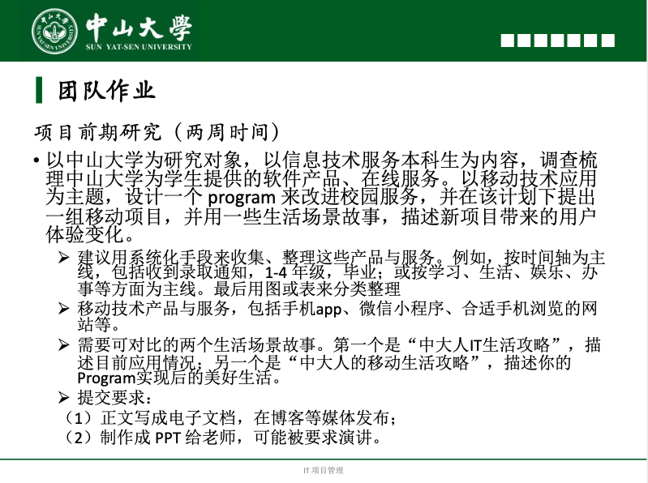

# TeamWork 1

## 一、作业内容

## 二、团队答案

- **博客地址：[项目前期研究报告](https://blog.csdn.net/weixin_40377691/article/details/105938807)**

- **PPT：[IT项目管理：项目前期研究报告](IT项目管理：项目前期研究报告.pptx)**

## 三、成员贡献

|           分工内容            |  完成人  | 任务占比 |
| :---------------------------: | :------: | :------: |
|     小组成立&作业讨论会议     | 全体成员 |   26%    |
|       背景梳理（概述）        |  张泽琳  |    4%    |
|     系统化整理、图表制作      |  赵正蔚  |   13%    |
|         主要竞品分析          |  张嵚竹  |   20%    |
| 设计program，计划一组移动项目 |  赵正蔚  |   13%    |
|           场景描述            |  张泽琳  |    8%    |
|      文章整理、发表博客       |  张嵚竹  |    4%    |
|            PPT制作            |  张泽琳  |   12%    |

