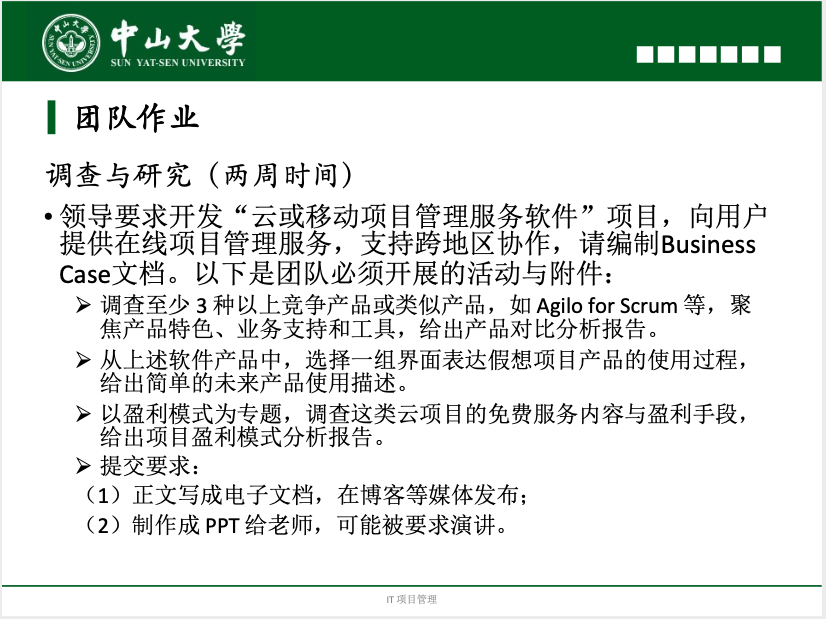

# Teamwork 2

## 一、作业内容

## 二、团队答案

- **博客地址：[在线项目管理软件的调查与研究](https://blog.csdn.net/Passionzq/article/details/106365997)**

- **PPT：[IT项目管理：调查与研究](IT项目管理：调查与研究.pptx)**

  

## 三、成员贡献

|     分工内容     | 完成人 | 任务占比 |
| :--------------: | :----: | :------: |
|     业务目标     |  张淇  |    5%    |
| 当前的形势和问题 |  张淇  |   20%    |
|  项目的初步需求  |  张淇  |   10%    |
| 未来产品使用描述 |  张淇  |   15%    |
|   项目盈利模式   | 赵正蔚 |   20%    |
|     潜在风险     |  张淇  |   10%    |
|       ppt        |  张淇  |   20%    |