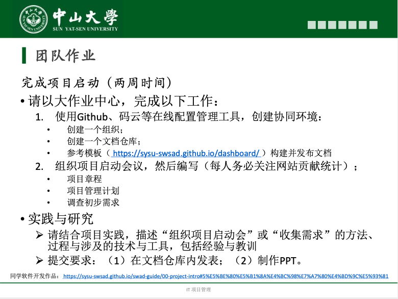

# TeamWork 3

## 一、作业内容

## 二、团队答案

- **[会议议程](会议议程.pdf)**
- **[项目章程](项目章程.md)**
- **[项目管理计划](项目管理计划.md)**
- **[调查初步需求](调查初步需求.md)**
- **[实践与研究](实践与研究.md)**
- **[PPT](IT项目管理：项目启动.pptx)**

## 三、成员贡献

|                     分工内容                     | 完成人 | 任务占比 |
| :----------------------------------------------: | :----: | :------: |
| 制作项目章程、项目管理计划、调查初步需求文档模版 | 赵正蔚 |    5%    |
|                组织并召开启动会议                |  张淇  |    3%    |
|                   完成项目章程                   | 张伟焜 |    7%    |
|                                                  | 杨泽涛 |    7%    |
|                 完成项目管理计划                 |  张昊  |    7%    |
|                                                  | 吴荆璞 |    7%    |
|                 完成初步调查需求                 | 朱龙威 |    7%    |
|                                                  | 张云青 |    7%    |
|            搭建GitHub仓库，写使用说明            | 张涵健 |    7%    |
|                                                  |  徐肯  |    7%    |
|                                                  | 左杰文 |    7%    |
|   整合项目章程、项目管理计划、调查初步需求文档   |  张淇  |    2%    |
| 整合会议记录、描述～方法、～技术与工具、经验教训 | 张泽琳 |   13%    |
|                     制作PPT                      | 赵正蔚 |   14%    |

