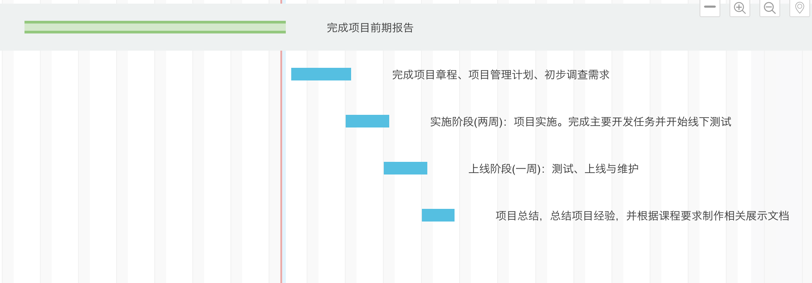

# 项目章程

**项目名称** 掌上中大开发项目

**授权日期：** 2020年4月24日

**项目开始日期** 2020年5月1日                        **项目结束日期：** 2020年7月25日（暂定、预计）

---

**关键日程里程碑：**

- 2020年5月6日：完成项目前期报告

- 2020年6月24日：完成项目章程、项目管理计划、初步调查需求

- 2020年7月4日实施阶段(两周)（开始时间为暂定）：项目实施。完成主要开发任务并开始线下测试

- 2020年7月11日上线阶段(一周)：测试、上线与维护

- 2020年7月18日后：项目总结，总结项目经验，并根据课程要求制作相关展示文档

  

---

**预算：**（单位：人民币）

- 开发人员报酬：0
  - 备注：该项目为项目组成员自愿开发项目。
- 开发人员时间成本：13人月

  - 时间成本也应是项目预算的一部分，该项目耗时预计一月，参与项目人员共13人，因此预期人力时间成本为13人月
- 前期宣传：0~500
  - 备注：该项目为课程任务，不需要宣传费用。若实际投入市场使用，需要大约500的宣传费用
- 技术花费： 0
  - 备注：项目采用微信小程序开发，且目前规模较小，暂不需要租赁服务器。

---

**项目经理：**
张淇，xxxxxxx（电话号码），xxxxxxx@xxx（邮箱）

---

**项目目标：**

&emsp; &emsp; 为中山大学的学生用户提供一款既能一站式解决其校园生活类日常需求，又能够给学生用户一个自由讨论空间的集成化小程序。 

---

**高层级需求：**

&emsp; 	保证项目的流量控制，避免项目出现流量过大而奔溃的情况（稳定性的高要求）。

​		能够为项目持续带来流量，进行宣传。（项目宣传的要求）

---

**整体项目风险：**

1. 人力资源风险：组内成员可能因某种原因无法按时完成指定任务，导致整体项目延期
2. 预算资源风险：若项目投入市场实际使用，则需要相关经费，若经费不足则可能导致项目宣发失败
3. 不可抗力风险：如果项目遭遇不可抗力，如课程要求更改，课程截止时间提前等，则项目会面临困境。

---

**项目成功的主要标准：**

&emsp;&emsp;完成项目目标，并且交付小程序。小程序能够将目前中山大学校园生活类功能集成导航，使用户能够一站式使用所有的校园生活类功能 ，并由工具性的学生校园生活所需的日常功能产生黏性，在充分满足用户实用性需求的基础上，聚集用户并利用社交功能来带动学生群体的活跃度 。

---

**方法：**

- 通过线上会议讨论，完成项目前期准备工作
- 收集类似案例，总结以往项目经验
- 通过多种渠道收集并整理需求
- 相关技术人员阅读小程序开发文档进行技术准备工作
- 开发小程序，完善相应需求
- 内部测试，进行相关功能的完善
- 压力测试，测试项目的流量承受力
- 邀请部分学生用户进行测试
- 小程序审核并上线，相关人员负责后期运维
- 如果有投入市场的打算，则需要进行后续的项目宣传

---

**职位角色及职责：**

|  姓名  |    角色    |   职位   |  联系方式   |
| :----: | :--------: | :------: | :---------: |
|  张淇  | 项目组组长 | 项目经理 | 1xxxxxxxxxx |
| 赵正蔚 | 项目组成员 | 产品经理 | 13611263068 |
| 张泽琳 | 项目组成员 | 产品经理 | 1xxxxxxxxxx |
| 张嵚竹 | 项目组成员 | 产品经理 | 1xxxxxxxxxx |
| 张云青 | 项目组成员 | 前端开发 | 1xxxxxxxxxx |
| 张涵健 | 项目组成员 | 前端开发 | 1xxxxxxxxxx |
|  徐肯  | 项目组成员 | 前端开发 | 1xxxxxxxxxx |
| 左杰文 | 项目组成员 | 前端开发 | 1xxxxxxxxxx |
| 张伟焜 | 项目组成员 | 前端开发 | 1xxxxxxxxxx |
| 朱龙威 | 项目组成员 | 前端开发 | 1xxxxxxxxxx |
| 杨泽涛 | 项目组成员 | 后端开发 | 1xxxxxxxxxx |
|  张昊  | 项目组成员 | 后端开发 | 1xxxxxxxxxx |
| 吴荆璞 | 项目组成员 | 后端开发 | 1xxxxxxxxxx |

---

**签署人：（上述全部利益相关者签名）**

张淇  赵正蔚  张泽琳  张嵚竹  张云青  张涵健  徐肯  左杰文  张伟焜  朱龙威  杨泽涛  张昊  吴荆璞

---

**意见（由上述利益相关者手写或打印）**

已批准该项目章程。

  
——张淇
  
对此项目章程无异议。

  
——赵正蔚、张泽琳、张嵚竹、张云青、张涵健、徐肯
  
  
左杰文、张伟焜、朱龙威、杨泽涛、张昊、吴荆璞
  
---
