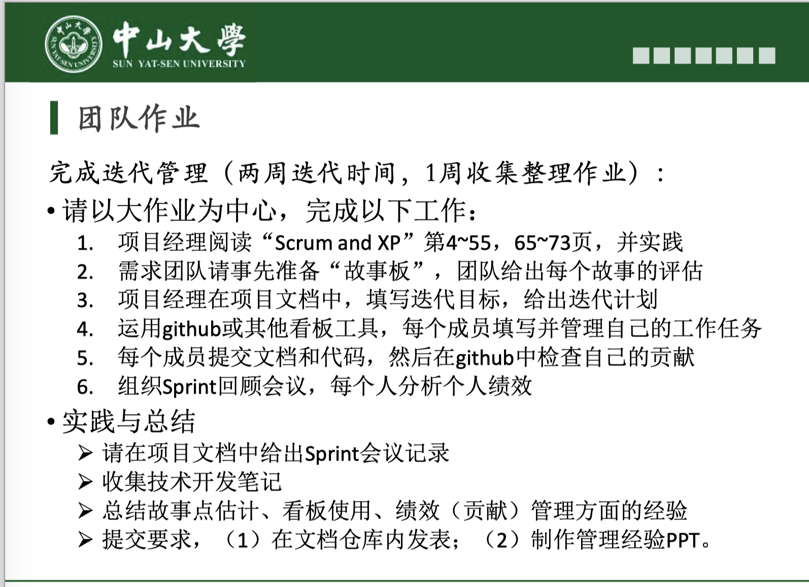

# TeamWork 4

## 一、作业内容

## 二、团队答案

- **[Scrum介绍](Scrum介绍.md)**
- **[作业讨论&Scrum介绍的会议记录](作业讨论&Scrum介绍的会议记录.pdf)**
- **[Product Backlog](https://docs.qq.com/sheet/DVk9DTHNuZURqVEhD?tab=BB08J2)**
- **[迭代计划](迭代计划.md)**
- **[Sprint计划会议的会议记录](Sprint计划会议的会议记录.pdf)**
- **[Sprint信息页](Sprint信息页.md)**
- **[封闭开发过程](封闭开发过程.md)**
- **[Sprint演示](https://www.bilibili.com/video/BV1L5411a7nj)**
- **[Sprint回顾会议的会议记录](Sprint回顾会议的会议记录.pdf)**
- **[技术开发笔记](./技术开发笔记/技术开发笔记.md)**
- **[实践总结报告](实践总结报告.md)**
- **[PPT](管理经验.pptx)**

## 三、成员贡献

|                     分工内容                     |  完成人  | 任务占比 |
| :----------------------------------------------: | :------: | :------: |
|     组织并主持会议：团队作业分析、介绍Scrum      |   张淇   |    2%    |
|                     会议记录                     |  张泽琳  |    2%    |
|                   制作迭代计划                   |   张淇   |    2%    |
|                    制作故事板                    |  赵正蔚  |    2%    |
|                                                  |  张泽琳  |    1%    |
|                                                  |  张嵚竹  |    1%    |
|                                                  |   张淇   |    1%    |
|     组织并主持会议：Sprint Planning Meeting      |   张淇   |    2%    |
|                     会议记录                     |  张嵚竹  |    2%    |
|                    制作信息页                    |  赵正蔚  |    1%    |
|                   开发过程分工                   |  张涵健  |    1%    |
| 系统设计（逻辑框架、界面UI构想），及相应技术笔记 |  朱龙威  |    7%    |
|       开发校园常用网址界面，及相应技术笔记       |  吴荆璞  |    7%    |
|      开发校园常用公众号界面，及相应技术笔记      |  张伟焜  |    7%    |
|         开发社团服务界面，及相应技术笔记         |  杨泽涛  |    8%    |
|    开发东校园建筑坐标位置界面，及相应技术笔记    |  左杰文  |    7%    |
|  开发东校园周边娱乐场所位置界面，及相应技术笔记  |  张涵健  |    7%    |
|       开发中大新闻、资讯页，及相应技术笔记       |  张云青  |    7%    |
|     开发项目主页（导航）界面，及相应技术笔记     |   徐肯   |    8%    |
|          后端开发、部署，及相应技术笔记          |   张昊   |    7%    |
|                    Sprint演示                    | 开发团队 |    9%    |
|             Sprint回顾会议的会议记录             |  张嵚竹  |    2%    |
|                 整合技术开发笔记                 |  张嵚竹  |    1%    |
|                   实践总结报告                   |   张淇   |    3%    |
|                     制作PPT                      |  张泽琳  |    4%    |

