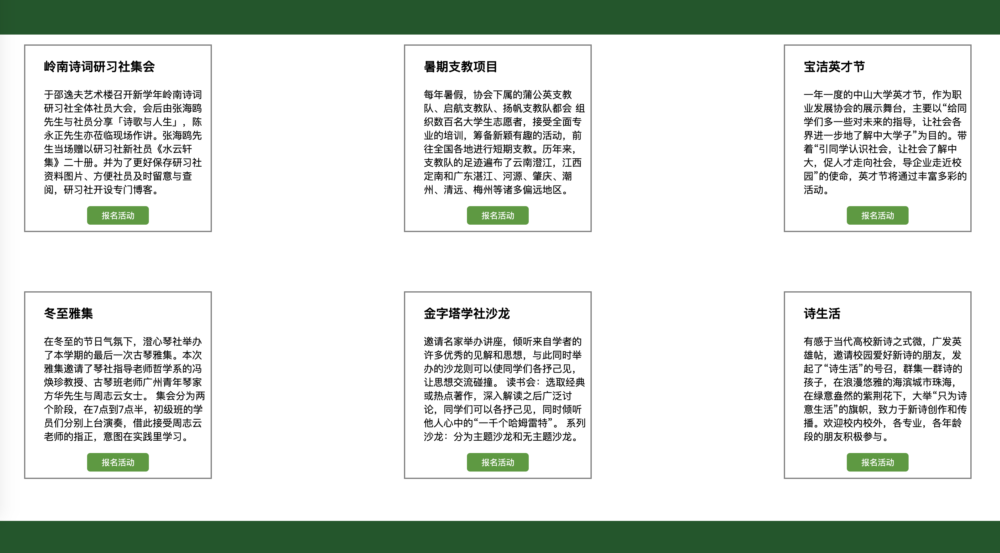
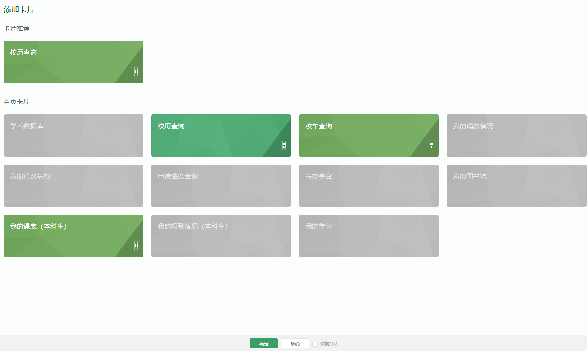
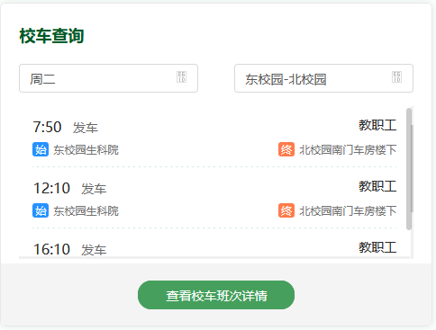
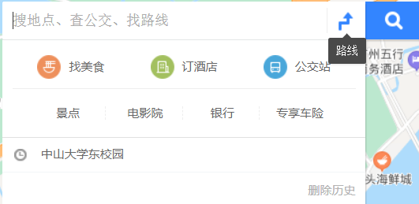

# 一、前端
## 1. 社团活动功能
> 开发人员：杨泽涛
>
> 学号：17343140
### 开发工具
1. 伪类
2. Flask
3. 原生JavaScript

### 开发内容

开发完成**社团和活动**功能，具体实现内容有：

1. 收集中山大学学生社团相关信息和活动相关内容

2. 主界面的背部图片轮动效果，要求可以点击箭头和下列原点进行切换
3. 实现社团搜索关键词推荐相关社团功能
4. 实现社团详细信息查看功能
5. 实现活动详细信息查看功能
6. 实现社团报名功能
7. 实现活动报名功能

### 开发记录

**七月二十日**

收集了中山大学相关学生社团的信息，具体包括：岭南诗词研习社，青年志愿者协会，学生职业生涯发展协会，澄心琴社和中山大学金字塔琴社的信息。

收集了社团相关活动信息，具体包括：暑期支教项目，宝洁英才节，冬至雅集，金字塔学社沙龙，诗生活。

开始了主页面的背部图片轮转功能的实现，暂时只实现了图片自动轮转的效果。


遇到的困难有：不知道如何实现图片轮转的效果，经过尝试发现实现思路应该是将图片以浮动形式放在div中，并且设置div为溢出隐藏，在需要切换图片的时候应该移动的是div的位置，这样用户看起来就是图片在移动的效果了。实现完基本的图片切换功能后又遇到一个困难是不知道如何实现图片轮转的效果（即从最后一张图片返回到第一张图片），经过思考后决定在原有图片之前加上最后一个图片，并在图片列表之后加上第一个图片，一前一后两个图片作为假象迷惑用户，当列表移动到这两个图片位置时，列表会瞬间改变位置到图片列表首或图片列表尾，这样就实现了循环的效果。

**七月二十一日**

继续开发主页面背部图片轮转功能，加入了箭头切换功能


并且加入底部索引图标功能，该索引亦可用于图片切换


红色为鼠标位置，绿色为当前图片位置。

遇到的困难有：下列索引的颜色显示功能一开始不知道如何实现，后面的解决思路是利用class=”light“这个类标注来标注某个圆点是否正在展示图片，并在css样式表中对正在展示图片的原点的颜色改成绿色。鼠标悬停改变成红色以及两个箭头位置鼠标悬停背景变成灰白这一功能的实现是通过hover伪类实现的。

**七月二十三日**

完成了主页面和社团页面，活动页面的UI布置：





通过组内协商，顶部和底部的导航栏由负责主页的同学统一设计，所以我先预留相关位置，并配上相应主题色。

遇到的困难：单纯的UI设计很简单，但是要适应不同尺寸的屏幕的UI就需要设计好各个div盒的定位，不能直接粗暴地使用绝对定位，因为这样会在不同尺寸的电脑屏幕上出现错位，要尽量使用window.screen的相关参数（包括width，height）来进行位置定位。

**七月二十四日**

实现搜索功能和社团报名，活动报名功能。


遇到的困难：搜索功能一开始不知道怎么实现，后面是使用关键词搜索法实现的。通过用户输入的字符，从中筛选出相关的关键词，通过关键词来进行社团的推荐，若没有推荐社团，则通知用户暂无相关社团。

**七月二十五日**

开发了社团报名和活动报名的功能。


遇到的困难：报名功能的实现一开始没有头绪，因为我们暂时还没有一个完整的账号管理系统，所以我的解决方案是将报名信息写到本地csv文件里面，但是这样做遇到一个问题就是JavaScript不支持对本机的任何读写行为，所以我只能自己搭建一个简易后端，监听5010端口，通过JavaScript对5010端口发送数据，然后在后端将数据追加到我们的csv数据库中。

**整合工作**

在第一次sprint会议之后，我对我的各个页面进行了导航栏整合工作，解决了css和js的各种样式冲突问题。

### 开发总结

本次开发收获很多，用上了很多当初Web2.0课程学习到的知识，中间也遇到了不少以前没有遇到的困难，很幸运能够顺利解决它们。经过本科三年的学习，我发现我已经对前后端和数据处理，数据传送都有一定的了解，遇到相关问题能够比较快地找到解决思路，从而能顺利完成一个简单项目，这是我最大的收获。

本次开发也是我第一次正式在一个正规项目开发组下的监督进行的，我对开发进度，看板使用和项目管理都有了一个比较深的理解。


## 2. 新闻查询页
> 开发人员：张云青
>
> 学号：17343157 
### 开发工具
- 页面主要采用html+css进行页面构建
- 选择新闻的时候引入部分JavaScript.
### 开发内容
**相关参数：**

- 新闻部分总宽度1000px
- 每个模块宽度490px,margin为5px 5px 0px 0px
- 模块标题14px，新闻标题12px

**主要技术**

- 采用js实现鼠标移动到不同标题切换页面：

	新闻模块有两个部分，分别是中大新闻和 NEWS & EVENTS，在span的onMouseOver属性调用js函数switchNews进行页面转换，switchNews函数如下：

```css
	function switchNews(sysunews,newslist)
	{
		for(i=1; i <3; i++)
		{
			if ("sysunews0"+i==sysunews)
			{
				document.getElementById("sysunews0"+i).className="";
				
			}else{
				document.getElementById("sysunews0"+i).className="newsdown";
				
			}
			if ("newslist0"+i==newslist)
			{
				document.getElementById(newslist).className="";
			}else{
				document.getElementById("newslist0"+i).className="hidecontent";
			}
		}
	}

```

- 阴影分隔线的实现

	阴影分割线是在css中设置背景图为阴影图，并设置属性为no-repeat bottom center，然后把这个属性作为父元素的属性。

	```css
	.channel_shadow{
	padding:0px 0px 5px 0px;
	background:url(../images/bo-shadow.jpg) no-repeat bottom center;
	}
	```

- 切换模块内容只修改内部元素

	切换新闻和媒体的另一个模块时采用的是iframe标签，可以在不改变外框架的情况下修改内部元素：

	```css
	<iframe id="ifmtzd" src="" frameborder="0" scrolling="no" height="196" width="356" noresize="noresize"></iframe> 
	```


### 测试流程
**静态代码分析**

- [W3C Markup Validation Service]( https://validator.w3.org/ ) 检查通过

- [W3C CSS Validation Service]( http://jigsaw.w3.org/css-validator/ )检查通过 

 **单元测试**

- 检测用户鼠标在各个按钮悬停时是否能正常切换子页面
- 检测点击更多是否能跳转到中大新闻网
- 检测点击新闻能否跳转到详情

**测试结果：**

- 鼠标悬停在“中大新闻”和“NEWS&EVENTS”标题时，模块内可分别显示中文和英文的中大新闻子页；悬停在“学术预告”和“ACADEMIC ANNOUNCEMENTS”标题时，模块内可分别显示中文和英文的预告
- 点击更多和进入按钮会跳转到中山大学新闻网
- 点击“中大新闻”、“科研专栏”和“媒体中大”标题下的文章题目可以跳转到中山大学新闻网的对应新闻，点击“NEWS&EVENTS”标题下的文章题目会跳转到中山大学英文版网页新闻，点击“学术预告”标题下的文章标题可以查看对应讲座或访谈的通知，点击“ACADEMIC ANNOUNCEMENTS”下文章标题显示英文版讲座通知，点击“重要通知”下文章标题显示通知原文。
- 鼠标悬停在文章标题显示文章全名


**集成测试**

- 与其他页面联动测试，检查页面能否正常跳转，单元测试功能是否正常

**测试用例**

- 鼠标分别悬停到“中大新闻”和“NEWS & EVENTS”上
- 鼠标分别悬停到“学术预告”和“ACADEMIC ANNOUNCEMENTS”
- 点击“更多”和“进入”按钮
- 随机点击每个模块中的新闻标题

## 3. 校内地图页
> 开发人员：左杰文
>
> 学号：17343166

### 功能描述
1. 对中山大学东校区建筑在地图上进行标记
2. 输入建筑名称对建筑地点进行查询，在地图上显示地点
3. 可对地图进行一般的操作（地图放大、缩小，移动地图）

### 技术笔记

使用web实现，地图使用百度地图API，通过调用百度地图提供的API构建网页上的地图。

地图上建筑物的标记点需要手工标注，将所有标记的点储存在一个数组中。

point表示该标记点在地图上的位置，这里的位置不是经纬度，只在百度地图上表示标记的位置。
对于建筑的搜索，使用一个input标签进行实现。

在点击搜索按钮后对输入内容进行查询，在上面的标记点数组中查询是否有输入的建筑物，这里的查询是直接找是否有输入的子字符串，所以返回结果是一个数组，返回所有包含输入的内容的地点，并将这些地点标记出来。
显示标记的方法是调用百度地图提供的API，生成一个覆盖物以表示查询的地点。

为了能够让用户更好的看到所有的搜索结果，搜索之后会将地图的中心点移动到所有点的中心位置，也就是最左上的点与最右下的点连线的中点作为地图的中心点，这样基本就能看到搜索的所有点。
对于查找不到的建筑，使用弹窗进行提示。


### 测试流程
**静态代码测试**
使用插件来进行相关语法监测：
1. htmlhint对html语法进行检测；
2. stylelink对css语法进行监测。


**单元测试**
1. 网页是否能够成功打开：点击index.html文件在网站中打开。
2. 网页在各个浏览器显示是否正常：分别在safari与google浏览器进行测试，能够正常显示运行。
3. 能否在搜索框中输入地点：点击搜索框，进行文本的输入。
4. 点击搜索按钮后能否进行对输入地点进行搜索：在搜索框中输入字符串，点击按钮搜索。
5. 能否搜索出匹配的所有地点：在搜索框中输入地点，如“至善园”，地图上显示至善园的所有建筑。
6. 地图能否根据搜索到的地点自动移动到该位置：输入某个地点，点击搜索，查看网站地图中心为该地点。
7. 搜索没有标注的地点显示弹窗提示。

**测试用例**
1. 输入“至善园”，显示所有至善园的建筑，并将地图中心移动到所有建筑的中心位置。


2. 输入至善园11号，没有该地点，进行弹窗提示


## 4. 网页导航
> 开发人员：吴荆璞
>
> 学号： 17343117

### 开发工具
- 语言：html、css、javascript
- 第三方库：Bootstrap、JQuery、Animate.css
- IDE：VS Code 1.45.1

### 功能需求
开发一个网页导航界面，能够根据不同的办事需求跳转到相应的中山大学相关网站，需支持以下功能：

 1. 能够进行健康申报
 2. 能够进行课程表、考试时间、校历等的查询
 3. 能够提供成绩查询、培养计划查询等教务服务
 4. 能够提供选课服务和课程查询
 5. 能够提供体育场地预定
 6. 能够提供新活、教室等的申请服务
 7. 能够提供图书借阅、馆藏查询服务

### 开发过程
**收集信息**
首先需要收集相关功能及其对应的网址信息，根据我找到的信息，整理如下：

 - 中山大学统一门户：https://portal.sysu.edu.cn    
 - 提供服务：健康申报
 - 中山大学本科教务系统：https://jwxt.sysu.edu.cn
 - 提供服务：课程表查询、成绩查询，培养计划查询、选课和课程查询、考试时间查询
 - 中山大学教务部：http://jwb.sysu.edu.cn
 - 提供服务：校历查询
 - 中山大学体育场馆管理与预定系统：http://gym.sysu.edu.cn/index.html
 - 提供服务：体育场地预定
 - 中山大学大学服务中心：https://usc.sysu.edu.cn
 - 提供服务：课室申请、新活申请
 - 中山大学图书馆：http://library.sysu.edu.cn
 - 提供服务：图书借阅，文献检索

 **网页设计**
根据上述收集到的信息，设置6个按钮（button），点击后跳转到对应网址。另分别在按钮右侧附上功能说明信息，与按钮对其。我使用一个overall-box包裹所有内容，其中包含6个line，每个占一行。每个line中包含一个button和右边的功能说明框description，两者高度相同且对其，后者长度较大（因文字内容可能较多）。上方导航栏和title以及底部栏暂时仅做粗略的设计，后续会与主页进行整合。配色统一使用小组同学量取的中大网页常用的两种绿色（深、浅）以及灰、白色背景。

**主页整合**
在小组同学完成主页设计后，将其上方导航栏及底部栏部分复制过来，并更改使得白色光标停留在“站点导航”栏，路径根据小组的命名规范统一设置，以方便后续的部署及导航栏按钮的跳转。

### 开发总结
本次我的开发工作比较简单，不涉及后端工作，只是单纯地将各网站list出来并进行简单的页面设计。这让我稍微温习了一下许久没用的web知识，并增进了协同开发Web产品demo的经验。我们小组的分工非常明确，前端部分在主页整合前可以完全并行工作，而每个人的目录、相应文件命名以及配色的使用也有统一规范，使得后续的整合和后端部署比较方便。我们使用一个共同的Github仓库进行协同开发，并应用看板进行进度管理，整个开发进程基本按部就班，没有什么太大的问题。通过这次协同开发过程，我对项目进度管理，特别是看板在其中的应用有了更具体的认识。

### 测试流程
**静态代码分析**
VSCode自检测，消除所有warning和error

**单元测试**
1. 测试中山大学统一门户是否可正常跳转（点击按钮）
2. 测试中山大学本科教务系统是否可正常跳转（点击按钮）
3. 测试中山大学教务部是否可正常跳转（点击按钮）
4. 测试中山大学体育场馆管理与预定系统是否可正常跳转（点击按钮）
5. 测试中山大学大学服务中心是否可正常跳转（点击按钮）
6. 测试中山大学图书馆是否可正常跳转（点击按钮）

**集成测试**
测试网页6个模块的跳转功能是否正常及跳转页面是否正确

**测试用例**
1. 进入网页，点击中山大学统一门户按钮，跳转后返回网页
2. 点击中山大学本科教务系统按钮，跳转后返回网页
3. 点击中山大学教务部按钮，跳转后返回网页
4. 点击中山大学体育场馆管理与预定系统按钮，跳转后返回网页
5. 点击中山大学大学服务中心按钮，跳转后返回网页
6. 点击中山大学图书馆按钮，跳转后返回网页，测试流程结束


## 5. 娱乐场所地图
> 开发人员：张涵健
>
> 学号： 17343147


### 功能描述

提供（东校园）周边娱乐健身等场所的查询服务（地图标点、标签分类）


### 开发工具

1. 高得地图api：[api](https://lbs.amap.com/api/javascript-api/guide/abc/prepare)
2. material button css实现：[material btn](https://www.jb51.net/css/642905.html)
3. 高德地图描点：[point](https://lbs.amap.com/api/javascript-api/guide/overlays/marker)
4. 高德地图位置获取：[position](https://lbs.amap.com/api/javascript-api/example/axis/transformate-between-coordinates-of-lnglat-and-map-container)

### 测试流程

 **静态代码分析**

VSCode自检测，消除所有warning和error

**单元测试**

1. 地图是否成功显示？（直接打开页面）
2. Sport是否成功显示？（点击Sport按钮）
3. Entertainment是否成功显示？（点击Entertainment按钮）
4. Restaurant是否成功显示？（点击Restaurant按钮）
5. Romantic spot是否成功显示？（点击Romantic spot按钮）
6. 导航栏功能是否正常？
7. 地图是否能自动聚焦返回？

 **集成测试**

点击其中一个Marker按钮，再点另一个按钮，其他按钮显示的地点是否会消失？

**测试用例**

**单元测试：**

1. 进入网页，点击Sport、点击Entertainment、点击Sport
2. 进入网页，点击Restaurant、点击Entertainment、点击Romatic spot
3. 进入网页，鼠标在地图上滑动滚轮、拖动滚轮

**集成测试：**

1. 进入网页，点击Romatic spot，滑动滚轮缩小地图，再放大地图、拖动地图、点击Sport、滑动滚轮缩小地图，再放大地图、拖动地图


## 6. 网页首页

> 开发人员：徐肯
>
> 学号：17343130 


### 功能描述

网页首页，提供到其他各个页面的导航

### 开发工具

+ Bootstrap
+ JQuery
+ Animate.css
+ 纯静态页面，通过 HTML + CSS + JavaScript 实现
### 开发内容
 **主页导航栏**

主体基于Bootstrap的导航栏、下拉菜单等组件，并进行内容以及样式的修改

**页面滚动相关动画实现**

基于Animate.css实现，通过监听页面滚动事件并动态添加对应动画类名实现


### 测试流程
**静态代码分析**

+ VSCode自检测，消除所有warning和error


**单元测试**

+ 导航栏是否能够正确选择当前页面对应的菜单项
+ 页面向下滚动时功能介绍部分能否正确显示

+ 各个链接是否能够正确跳转


## 7. 公众号收集页面

> 开发人员：张伟焜
>
> 学号：17343155


### 功能描述

提供有用的公众号的收集，能方便的跳转到对应公众号(显示二维码)

具体的公众号有：中山大学总务处、 中大信息技术服务帮助平台、 中山大学校园卡、叮宝校园、 中山大学服务中心USC 、 小课in中大。

以卡片形式展示公众号信息：

- 公众号标志(头像)
- 公众号名称
- 公众号简介及常用功能
- 查看二维码按钮。(当鼠标悬停于按钮上，会在按钮上方弹出二维码)


### 开发工具

静态页面开发，仅使用html+css构建页面。
### 开发内容

**相关参数：**

- 卡片大小：400*346px
- 头像与二维码大小：100*100px
- 卡片标题字号：20px
- 卡片文字字号：16px
- 卡片定位：
  - 第一行距顶部100px
  - 第二行距顶部550px
  - 第三行距顶部1000px
  - 每行卡片左右间距200px
- 页面背景色：#FBFEFC
- 导航栏与底部颜色：#005826
- 按钮颜色：#469F5D(非鼠标悬停状态) #005826(鼠标悬停状态)

**技术要点：**

- hover

  ```css
  .btn_qr:hover{
  	background-color: #005826;
  }
  
  
  .btn_qr:hover + .hide{
  	display: block!important;
  }
  ```

  由于`.btn` 与 `.hide`是兄弟元素，所以使用`+`；若`.hide`是`.btn`子元素，使用空格即可。

  在CSS中，通过对某一样式声明! important ，可以更改默认的CSS样式优先级规则，使该条样式属性声明具有最高优先级。

- 卡片边框及阴影

  ```css
  .card{
  	background-color:  #ffffff;
  	width: 400px;
  	height: 346px;
  	position: absolute;
  	float: left;
  	border: 1px;
  	box-shadow: 5px 5px 5px 0 rgba(0, 0, 0, .05);
  }
  ```

- 定位方式

  采用子元素绝对定位，父元素相对定位，能够很好地适应浏览器大小的变化。
  
- 控件封装

  我们将每个卡片进行封装，保证卡片内控件位置和样式一致。

  ```html
  <div class="card" id="c1">
  			<div>
  				
  				<div class="title">中山大学总务处</div>
  				<p class="content">
  					用于中山大学总务处信息发布、工作宣传。常用功能：班车查询、水电交费、物业保修、地图查询、校历查询。
  				</p>
  				<div class="btn-container">
  					<div class="btn_qr">查看二维码</div>
  					<div class="hide"></div>
  				</div>
  			</div>
  		</div>
  ```

  同时，针对不同卡片，我们给其赋予不同的id通过id选择器来为各个卡片实现定位。

### 测试流程

 **静态代码分析**

- [W3C Markup Validation Service]( https://validator.w3.org/ ) 检查通过

- [W3C CSS Validation Service]( http://jigsaw.w3.org/css-validator/ )检查通过 

**单元测试**

- 检测用户鼠标在各个按钮悬停时是否能正常弹出二维码
- 检测二维码是否与卡片对应，扫描后能够跳转到正确的公众号
- 缩放页面，观察各个控件的布局是否错乱

**集成测试**

- 与其他页面联动测试，检查页面能否正常跳转，单元测试功能是否正常

**测试用例**

- 缩放页面，观察布局情况

- 中山大学总务处二维码获取

- 中大信息技术服务帮助平台二维码获取

-  中山大学校园卡二维码获取

- 叮宝校园二维码获取

- 中山大学服务中心USC 二维码获取

- 小课in中大二维码获取

## 8. 设计与整合

> 开发人员：朱龙威
>
> 学号： 17343165

### 设计规范

- 主题色:中山大学主题色，rgb: (0,88,38)，hex: #005826

- 页面主题色，rgb: (0,128,0)，hex: #008000

-  原型设计：合并1 6和4 5的需求,总计4个主页面

### 主页设计
**功能需求:**

- 主页导航

- 新闻资讯

- 健康申报

- 课程表,校车,考试时间,校历等的查询

- 成绩查询,培养计划查询等教务服务

- 选课服务和课程查询,选课推荐

- 体育场地预订

- 新活,教室等申请服务

 **页面设计**

顶部为页面页眉,高度64px,有中大LOGO,有5个标签,分别是"我的主页","新闻公告","生活服务","社团服务","地图服务"点击可跳转对应页面,默认选择为我的主页.背景色为中大主题色,文字为白色


底部为页面页脚,高度51px,文字居中显示"技术支持: BBCUnion",背景色为主题色,文字为白色


右部侧边栏有编辑卡片,添加卡片,回到顶部的选项,保持页面相对位置不变


点击编辑卡片可选择拖动或删除当前页面的卡片


点击添加卡片可以选择更多的卡片显示在我的主页


灰色为未添加的卡片

底部有确定,取消和恢复默认的选项
**我的主页子页面**

顶部有功能导航栏,展示圆形图标list(横向排布),有"健康申报","本科教务管理系统"(包含成绩查询,考试时间,选课服务),"体育场地预订","新活场地申请"等,点击可跳转对应的官方网址


页面主体由卡片组成,主要有4个卡片,日历日程,课程表展示,校车查询和校历查询


左边是日历,可在下方查看校历,有添加日程功能,点击"添加私人日程"弹出窗口


右边是课程表查看,可按周查询,点击弹出下拉选择窗口


右下是校车查询和校历查询



选择周几和校园起点终点显示校车日程


点击查看完整校历弹出窗口显示校历图片


**新闻公告子页面**

页面主题由卡片构成,格式如下


点击某一项弹出新页面预览文档或下载


点击查看更多跳转子页面展示新闻列表


1页展示20项,底部有分页器


### 生活服务
 **功能需求**

- 公众号资源推荐,可跳转,至少5个,list展示

- 校园卡服务

- 订水,失物招领

- 网络中心

**页面设计**

顶部为功能图标栏,主要有"校园卡服务","订水","失物招领","网络中心",点击可以跳转到对应官方网站


页面主题以卡片形式展示为中山大学学生提供生活服务的公众号,点击查看详情按钮可以跳转对应公众号的微信网站

主要有"中山大学校园卡","中山大学总务后勤服务","中山大学信息技术服务帮助台","体适能","中山大学团委"等卡片,卡片格式如下:


公众号名称水平居中,左边贴图是公众号logo

按钮背景色:

rgb:(70,159,93)

每行展示2个卡片

### 社团服务

 **功能需求**

- 信息查询

- 社团推荐

- 社团活动报名

**页面设计**

顶部为大图,水平居中搜索框,提供信息查询功能

图片主要为展示中山大学学生的社团活动多姿多彩,体现中山大学学生充满青春活力,可在推文中随机选取展示或做成轮播图

搜索框为圆角矩形,左边有搜索图标,提示文字为"搜索",输入文字后右边有个小型"x"图标,点击可以清除文本框内文字

主体为卡片,有社团推荐,社团活动列表


### 地图服务

**功能需求**

东校园内 校园周边娱乐健身服务等地图位置服务

信息查询,地图标点,标签分类

**页面设计**

接入百度地图或高德地图等api,默认显示位置为中山大学东校园

页面主体为中山大学东校园地图


滑动鼠标滚轮可以放大缩小,同时左下角的地图比例也会随之改变


搜索框在左上角,点击下拉弹窗,有"校内设施","周边娱乐"和"健身设施"3个图标,并可以显示搜索历史和选择删除历史



右上角为筛选标签,勾选"校内","周边"便可以筛选出对应的地图标点


### 注意事项

主要参考中山大学统一门户网站进行开发,展示类内容使用卡片来布局;在设计中没有提及的功能不需要开发,在实际开发过程中可依照自己想法增加或删除细节
# 二、后端
> 开发人员：张昊
>
> 学号：17343148

## aliyun部署
 **阿里云镜像建立**
- 采用了`centos` +  `apache2`
- 安装`apache`,`yum install httpd`
- 查看是否安装 `service httpd start`
```
[root@izwz94f8hx4nyd6cwu32yaz BCCSchool]# service httpd start
Redirecting to /bin/systemctl start  httpd.service
```
- 部署到指定的文件夹下
- `cd /home/www/htdocs`
- `git clone https://github.com/BCCUnion/BCCSchool.git`
- 设置防火墙并且开启80端口
```
[root@izwz94f8hx4nyd6cwu32yaz BCCSchool]# sudo ufw enable
Command may disrupt existing ssh connections. Proceed with operation (y|n)? y
Firewall is active and enabled on system startup
[root@izwz94f8hx4nyd6cwu32yaz BCCSchool]# sudo ufw allow 80
Rule added
Rule added (v6)
```

**git pull 部署更新**
```
[root@izwz94f8hx4nyd6cwu32yaz BCCSchool]# git pull
remote: Enumerating objects: 22, done.
remote: Counting objects: 100% (22/22), done.
remote: Compressing objects: 100% (11/11), done.
remote: Total 13 (delta 8), reused 3 (delta 2), pack-reused 0
Unpacking objects: 100% (13/13), done.
From https://github.com/BCCUnion/BCCSchool
   fb098bb..f2f67cd  master     -> origin/master
Updating fb098bb..f2f67cd
Fast-forward
 ...274\200\345\217\221\347\254\224\350\256\260.md" | 48 +++++++++++++++++++++
 1 file changed, 48 insertions(+)
 create mode 100644 "frontend/Website/\346\212\200\346\234\257\345\274\200\345\217\221\347\254\224\350\256\260.md"
```

## ip访问测试
**主页链接**
- `http://120.79.67.250/BCCSchool/frontend/main/`


**新闻公告**

**站点导航**

**生活服务**

**校内导航**


