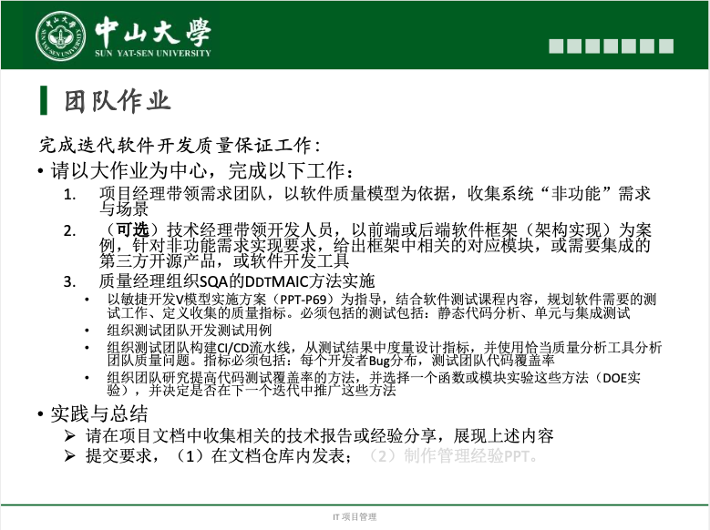

# TeamWork 5

## 一、作业内容

## 二、团队答案

- **[非功能需求](非功能需求.md)**

## 三、成员贡献

|                          分工内容                           |        完成人        | 任务占比 |
| :---------------------------------------------------------: | :------------------: | :------: |
|                      非功能需求与场景                       |        赵正蔚        |   10%    |
|         规划软件需要的测试工作、定义收集的质量指标          |        张涵健        |    5%    |
|                       对软件进行测试                        | 测试团队（除朱龙威） |   48%    |
| 构建CI/CD流水线，从测试结果中度量设计指标，分析团队质量问题 |        朱龙威        |   25%    |
|                研究提高代码测试覆盖率的方法                 |        朱龙威        |   10%    |
|                   整合技术报告或经验分享                    |        张嵚竹        |    4%    |