# 非功能需求
> 软件的非功能需求是指软件产品为满足用户业务需求而必须具有且除功能需求以外的特性。其影响着产品是否能够持续稳定并高效的提供服务。

## 性能要求
1. 吞吐量：支持至少500人同时在线
2. 响应时间：500人以内，在校园网条件下页面加载时间不超过1秒，500人以上页面加载时间不超过3秒
3. 用户操作过程中不出现闪退、黑屏等问题

## 可靠性要求

 1. 保证全天可获取服务，年非计划宕机时间不能高于8小时。
 2. 用户错误输入或操作时能提供提醒，要能够抵御常见的HTML注入攻击等web攻击
 3. 容错性：在系统出错时，不影响用户的行为操作与数据，比如：掉网，数据的录入做好本地保存，在网络恢复后，自动上传保存。

## 可维护性与扩展性需求
1. 应用要将各个功能模块化，支持灵活配置
2. 可复用性：类似组件应该统一设计，在需要用到的地方可进行微调然后调用。
3.	易分析性：易于诊断缺陷或失败原因，如日志记录系统，可追踪系统的历史使用情况。

## 安全性需求
1. 用户数据在进行发送的过程中要进行加密，保证用户填写个人信息安全（如社团报名申请）
2. 提供用户权限管理和用户数据访问权限管理,防止非法创建,删除或修改

## 易用性需求
1. 网页的界面,图形,文字,信息和标识应易于识别和理解
2. 有关网页执行的任何问题,消息和结果都应是易理解的,方便操作的
3. 选择恰当的术语,采用图形表示,提供背景信息和在线帮助功能等以实现易理解性
4. 关键功能的执行应是可逆的,或给出可你执行后果的明显警告,并在执行前要求确认.如数据删除和改写等
5. 数据查询结果准确

## 兼容性需求
1. 不同浏览器上显示的每个页面内容,布局,格式一致
2. 使用手机、iPad等移动设备均可正常浏览网页内容

## 非功能需求收集经验
需求分为功能需求和非功能性需求，但是由于功能需求在项目中的体现更加具体和具有可视性，在开发过程中常常会因为注重功能需求而忽略了非功能性需求。此外，非功能需求更加靠近的是技术，是设计，是实现，是架构师关注的内容，而这往往是需求人员最不擅长的方面，这也是非功能需求为什么常常被忽略的原因之一。因此，架构师应当尽早参与到项目中，参与到需求分析中，尽早分析需求的技术可行性并着手考虑性能、安全性、可靠性等非功能需求，尽早开始架构设计。

在非功能需求分析中另一个非常常见的错误，就是将非功能需求仅仅归结为一些放之四海而皆准的原则，对于非功能需求的设计并不能够仅仅停留在基本原则上，而要落实到对一个一个性能的分析中具体到数字。

非功能性需求的实现往往无法直观的给客户展现，因此对于客户来说这些非功能需求是透明的，不可见的，也是客户通常不关心的。以可维护性与扩展性需求为例，如果没有严格的规范和灵活的模块化分解，在维护系统、更改需求和升级的过程中将非常痛苦，没有章法就会徒增工作量。因此，在需求分析与设计阶段，可维护性实际上体现在，我们是否能有效识别系统可变的需求，并能够提供合理的方案，这些都是在非功能需求中所要涵盖和考虑的问题，也是整个项目开发过程中的重要环节。


# ci/cd test


## ci/cd流水线构建

本项目为小型前端网页应用项目, 使用纯web2.0开发, 使用Gitlab构建CI/CD流水线, 不需安装Gitlab runner而是使用gitlab.com提供的共享runner方便协作开发

**Gitlab CI/CD流程如下:**

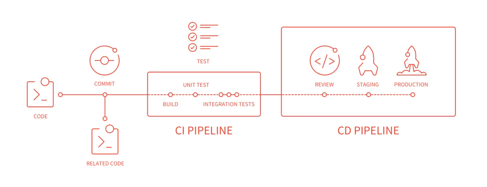

**Stages**

`Stages` 表示构建阶段，说白了就是上面提到的流程。默认有3个`stages`：`build`, `test`, `deploy`。我们可以在一次 `Pipeline` 中定义多个 `Stages`，这些 `Stages` 会有以下特点：

1. 所有 `Stages` 会按照顺序运行，即当一个 `Stage` 完成后，下一个 `Stage `才会开始
2. 只有当所有 `Stages` 完成后，该构建任务 (Pipeline) 才会成功
3. 如果任何一个 `Stage `失败，那么后面的` Stages `不会执行，该构建任务 (Pipeline) 失败

 **Jobs**

`Jobs` 表示构建工作，表示某个 `Stage` 里面执行的工作。我们可以在 `Stages` 里面定义多个 `Jobs`，这些 Jobs 会有以下特点：

1、相同 `Stage` 中的 `Jobs` 会并行执行

2、相同 `Stage` 中的 `Jobs` 都执行成功时，该 `Stage` 才会成功

3、如果任何一个 `Job` 失败，那么该 `Stage` 失败，即该构建任务 (Pipeline) 失败

**.gitlab-ci.yml**

`.gitlab-ci.yml` 用来配置 `CI` 用你的项目中做哪些操作，这个文件位于仓库的根目录。

当有新内容`push`到仓库，或者有代码合并后，`GitLab`会查找是否有`.gitlab-ci.yml`文件，如果文件存在，`Runners`将会根据该文件的内容开始`build`本次`commit`。

`.gitlab-ci.yml` 使用`YAML`语法， 你需要格外注意缩进格式，要用空格来缩进，不能用`tabs`来缩进。


CI/CD集持续集成和持续部署, 在我们的项目中, 集成和部署都已在后端完成, 单元测试交由开发者个人负责

 **具体构建步骤**

**使用Gitlab构建CI/CD流水线具体步骤如下:**

[官网](https://www.gitlab.com)注册gitlab账号, 完成基本设置如添加ssh key以方便git使用等

新建空项目, 成功后显示如下

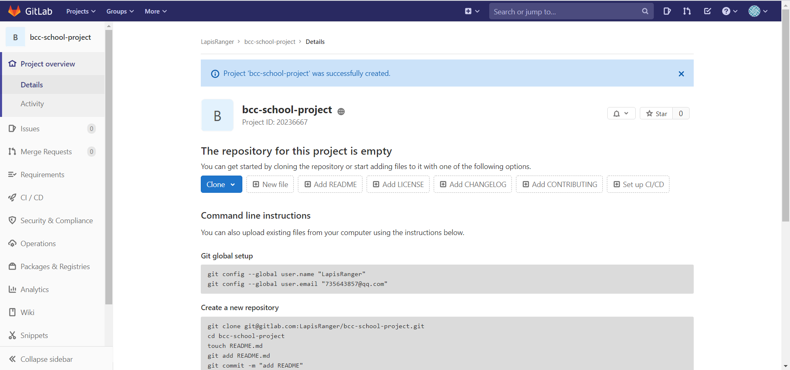

clone到本地, 在根目录下新建.gitlab-ci.yml脚本

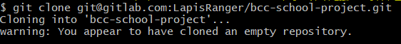

Gitlab CI使用的是[YAML](https://en.wikipedia.org/wiki/YAML)格式的文件(`.gitlab-ci.yml`)来作为配置文件，并且要放置在项目的根目录，否则不能识别。

如果使用npm打包的话可以使用官方给出的模板ci脚本

```yml
default:
  image: node:latest

  # Validate that the repository contains a package.json and extract a few values from it.
  before_script:
    - |
      if [[ ! -f package.json ]]; then
        echo "No package.json found! A package.json file is required to publish a package to GitLab's NPM registry."
        echo 'For more information, see https://docs.gitlab.com/ee/user/packages/npm_registry/#creating-a-project'
        exit 1
      fi
    - NPM_PACKAGE_NAME=$(node -p "require('./package.json').name")
    - NPM_PACKAGE_VERSION=$(node -p "require('./package.json').version")

# Validate that the package name is properly scoped to the project's root namespace.
# For more information, see https://docs.gitlab.com/ee/user/packages/npm_registry/#package-naming-convention
validate_package_scope:
  stage: build
  script:
    - |
      if [[ ! $NPM_PACKAGE_NAME =~ ^@$CI_PROJECT_ROOT_NAMESPACE/ ]]; then
        echo "Invalid package scope! Packages must be scoped in the root namespace of the project, e.g. \"@${CI_PROJECT_ROOT_NAMESPACE}/${CI_PROJECT_NAME}\""
        echo 'For more information, see https://docs.gitlab.com/ee/user/packages/npm_registry/#package-naming-convention'
        exit 1
      fi

# If no .npmrc if included in the repo, generate a temporary one to use during the publish step
# that is configured to publish to GitLab's NPM registry
create_npmrc:
  stage: build
  script:
    - |
      if [[ ! -f .npmrc ]]; then
        echo 'No .npmrc found! Creating one now. Please review the following link for more information: https://docs.gitlab.com/ee/user/packages/npm_registry/index.html#authenticating-with-a-ci-job-token'

        {
          echo '@${CI_PROJECT_ROOT_NAMESPACE}:registry=${CI_SERVER_PROTOCOL}://${CI_SERVER_HOST}:${CI_SERVER_PORT}/api/v4/projects/${CI_PROJECT_ID}/packages/npm/'
          echo '//${CI_SERVER_HOST}:${CI_SERVER_PORT}/api/v4/packages/npm/:_authToken=${CI_JOB_TOKEN}'
          echo '//${CI_SERVER_HOST}:${CI_SERVER_PORT}/api/v4/projects/${CI_PROJECT_ID}/packages/npm/:_authToken=${CI_JOB_TOKEN}'
        } >> .npmrc

      fi
  artifacts:
    paths:
      - .npmrc

# Publish the package. If the version in package.json has not yet been published, it will be
# published to GitLab's NPM registry. If the version already exists, the publish command
# will fail and the existing package will not be updated.
publish_package:
  stage: deploy
  script:
    - |
      {
        npm publish &&
        echo "Successfully published version ${NPM_PACKAGE_VERSION} of ${NPM_PACKAGE_NAME} to GitLab's NPM registry: ${CI_PROJECT_URL}/-/packages"
      } || {
        echo "No new version of ${NPM_PACKAGE_NAME} published. This is most likely because version ${NPM_PACKAGE_VERSION} already exists in GitLab's NPM registry."
      }
```

这里只进行最简单的ci/cd流水线构建, 也就是仅输出即可

stages中的执行流程是按定义的流程执行的，在该示例中的执行顺序即：build->test->deploy，也就是stage为build的job最先执行，成功之后执行下一个stage的job。如果多个job属于同一个stage，则会并行执行。

```yml
stages: # 定义Pipeline的阶段，可以多个
  - test
  - build
  - deploy

test: # 定义一个job
  stage: test
  script: echo "Running tests"

build:
  stage: build
  script: echo "Building the app"

deploy_staging:
  stage: deploy
  script:
    - echo "Deploy to staging server"
  environment:
    name: staging
    url: https://staging.example.com
  only:
    - master
```

可以使用CI Lint验证脚本文件格式是否正确

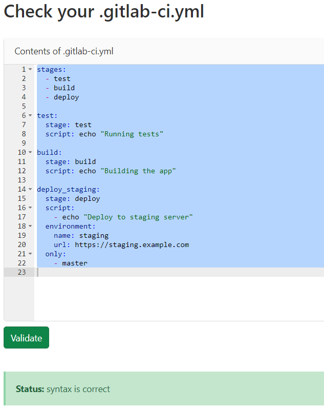

上传项目代码文件, 可在左侧边栏的CI/CD找到流水线运行结果

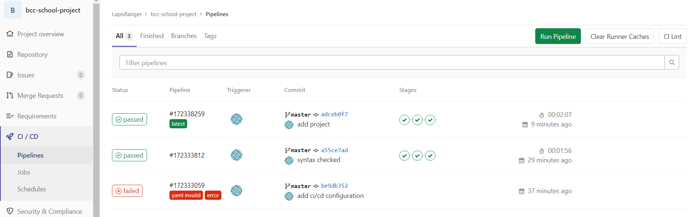

可以通过Piplines->Jobs查看流水线运行的Jobs
(img/1596076306768.png)

查看单个Job在共享gitlab runner上运行, 实际上脚本代码是在docker容器上执行

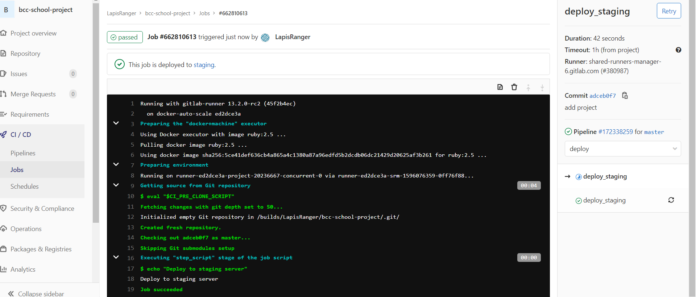

## Bug分布

使用<http://120.79.67.250/BCCSchool/frontend/main/>访问项目并测试

- 从首页进入新闻资讯页面(Consulting)后功能导航栏无法再跳转, 鼠标悬浮在其他标签页上显示url如下

 

  导航栏样式未修改


  应为


- 站点导航标签页的标题为英文, 与其他标签页标题风格不符, 应改成中文"站点导航"

- 社团服务标签页无法打开
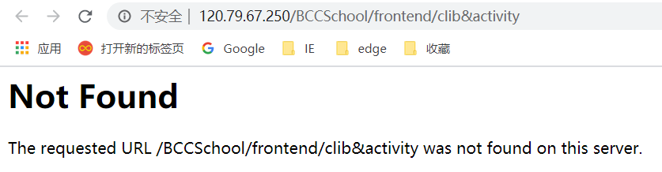

- 校内导航标签页无法打开;标题为英文

  

- 周边导航标签页标题为英文; 在选择了一个标点类型如"Sport"后拖动地图会被强制位移, 使得"Sport"地点永远位于地图中心, 而且选择一种类型之后无法取消, 只能切换另一种类型

## 网页性能测试

使用google在线分析工具, 如[PageSpeed Insights](<https://developers.google.com/speed/pagespeed/insights/>)和[GTmetrix](<https://gtmetrix.com/analyze.html>)

**PageSpeed Insights**

输入url测试, 这里以首页和新闻公告页为例

 **首页**

桌面设备得分


实验室数据


诊断结果


已通过的审核

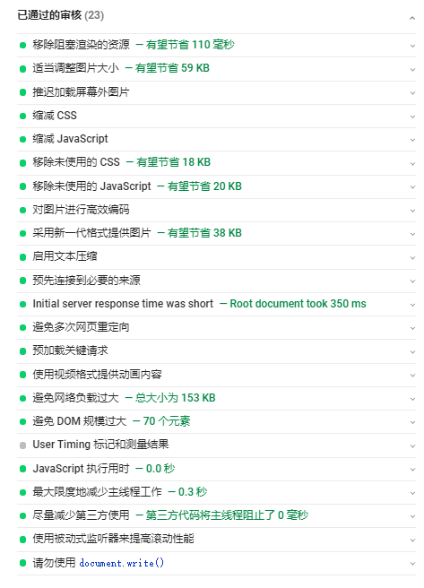

 **新闻公告页**

桌面设备得分


实验室数据


诊断结果


已通过的审核

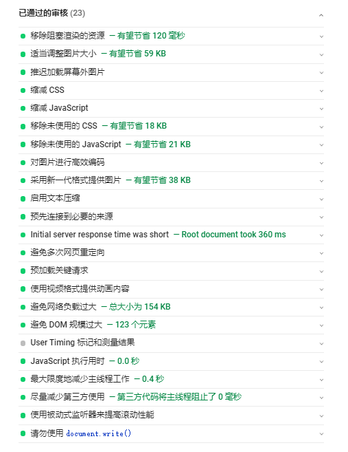

## 代码覆盖率

["代码覆盖率"](http://en.wikipedia.org/wiki/Code_coverage)（code coverage）有四个测量维度

> - **行覆盖率**（line coverage）：是否每一行都执行了？
> - **函数覆盖率**（function coverage）：是否每个函数都调用了？
> - **分支覆盖率**（branch coverage）：是否每个if代码块都执行了？
> - **语句覆盖率**（statement coverage）：是否每个语句都执行了？

前端ui代码html无法进行单元测试, 所以仅测试javascript文件的代码覆盖率

**Istanbul 测试js文件代码覆盖率**

安装使用步骤

> ```bash
> $ npm install -g istanbul
> $ istanbul cover index.js
> ```

main

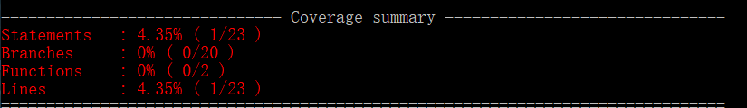

entertainment

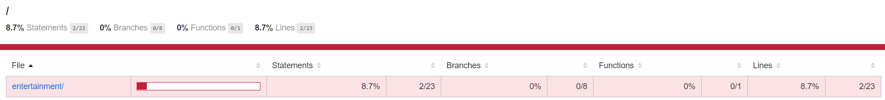

Website

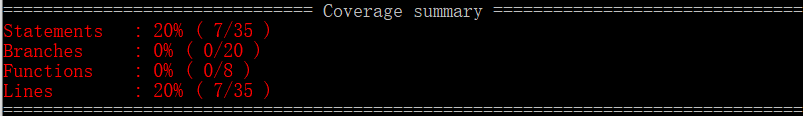

可以看到覆盖率普遍较低, 这是因为js代码中的函数主要是做界面交互, 所以没有用户输入的话语句无法被执行

instanbul主要还是用来自测脚本, 对于项目的代码还是需要设计测试用例, 可采用JSCover+selenium的解决方法
**谷歌DevTools**

使用谷歌浏览器, 按F12打开开发选项, 按如下步骤打开Coverage选项页

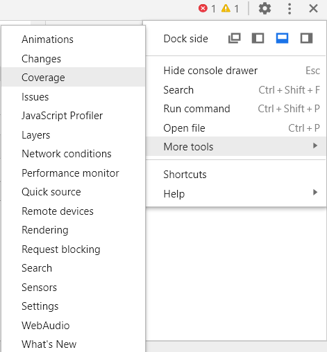

首页覆盖率

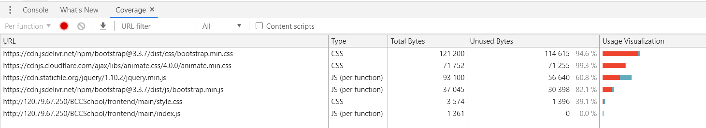

新闻公告页覆盖率

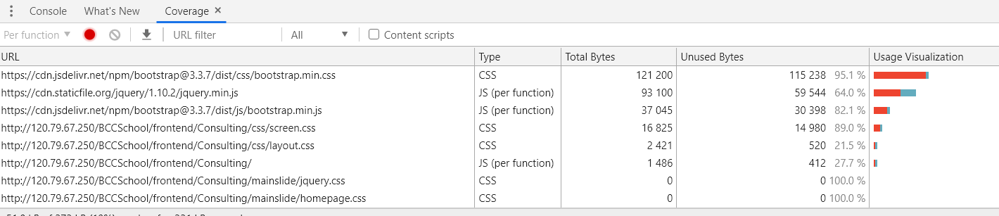

可以看到这里显示的js文件的代码覆盖率都是100%(未覆盖Unused Bytes为0)

周边导航页覆盖率

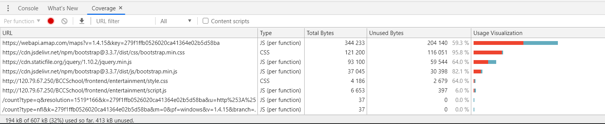

**如何提升代码覆盖率**

一般来说, 代码覆盖率分析工具总是与测试框架相结合, 如mocha等

提升代码覆盖率的方式有很多，最主要的方式还是增加用例，和优化代码。

关于测试用例构建可以参考[测试用例的设计－提高测试覆盖率](<http://www.51testing.com/html/02/4602-78069.html>)系列博客日志

1. 构造场景用例

根据业务流程规划测试用例，这是最主要的提升覆盖率的手段。最好由专人设计用例场景、提供校验准则，保证用例的有效性，同时可以大幅度的提升覆盖率。

2. 构造异常用例

正常流程是最容易被覆盖的，异常流程是最容易被遗忘的，常常也最难构造。但是异常用例却往往非常重要，不管是对业务逻辑还是对分支覆盖率都是如此。最好由业务专家分析必须首先覆盖的异常场景，再逐步对其他异常场景补充用例。

3. 剔除不需计算覆盖率的代码

例如UT/FT自身的代码、基本库代码、第三方库等，都是可以不计入覆盖率的。可以在统计时剔除掉。

4. 增加UT用例

对于FT比较难覆盖、逻辑比较复杂的函数，增加UT用例，对函数内各分支做覆盖，成本要比构造复杂的FT用例低得多。

5. 减少不必要的判断

比如用new分配内存的失败，会抛出异常。此时可以在程序外层捕捉异常，或者静态分配内存/池。不论哪种方式，都不必要在每次new之后都做指针判空。

6. 指针传参优化

对C++ 代码，函数参数可以传递引用，这样函数中就省去了对空指针的校验，即简化了代码，也增加了代码的健壮性。

7. 简化逻辑

反思代码复杂度是否与业务复杂度正相关？代码是否容易理解？是否因历史原因，不敢重构代码，只敢增加分支？很多逻辑复杂的代码，往往只是没有理清业务本质。

8. 消除重复代码

显而易见，相同逻辑如果散落在各处，对于提升覆盖率的明显会有更多的重复工作。

**提升代码覆盖率实验**

- 增加测试用例

  以周边导航页为例, 一开始点击按钮的js代码段未执行
  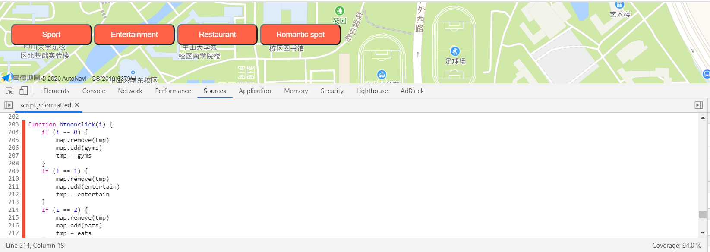

  此时的代码覆盖率为94%

  在增加测试用例即点击地图上方Sport按钮后覆盖率提升到100%

  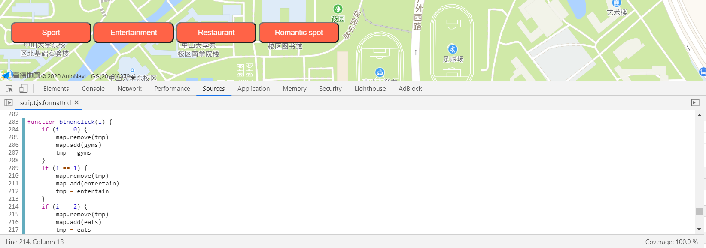

  

