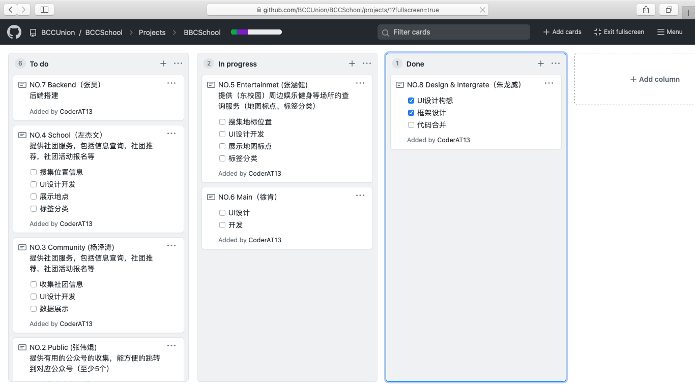
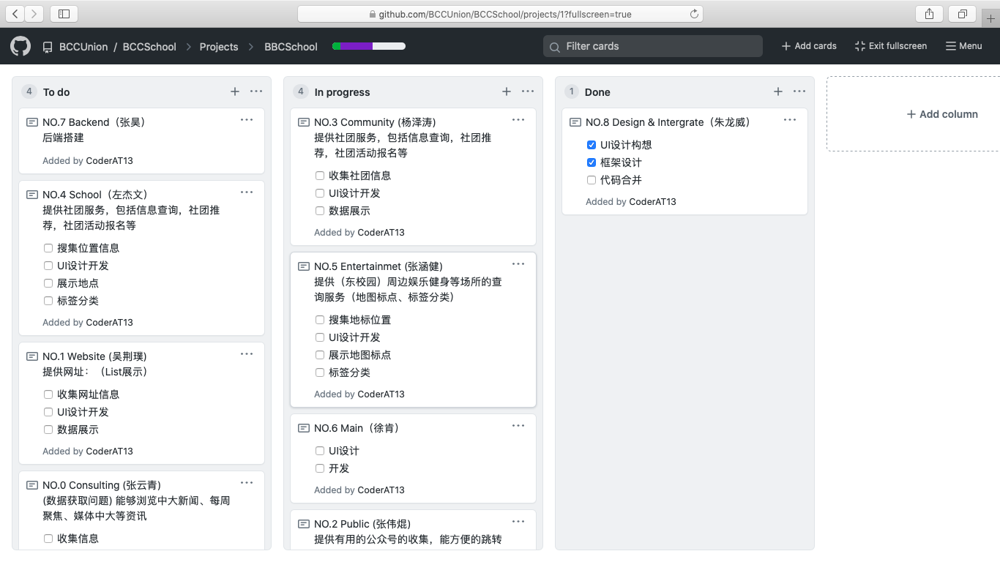
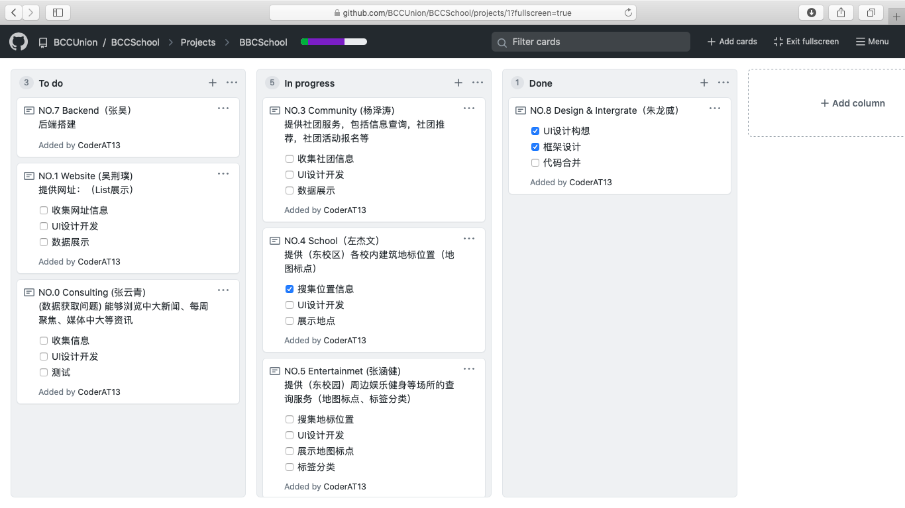
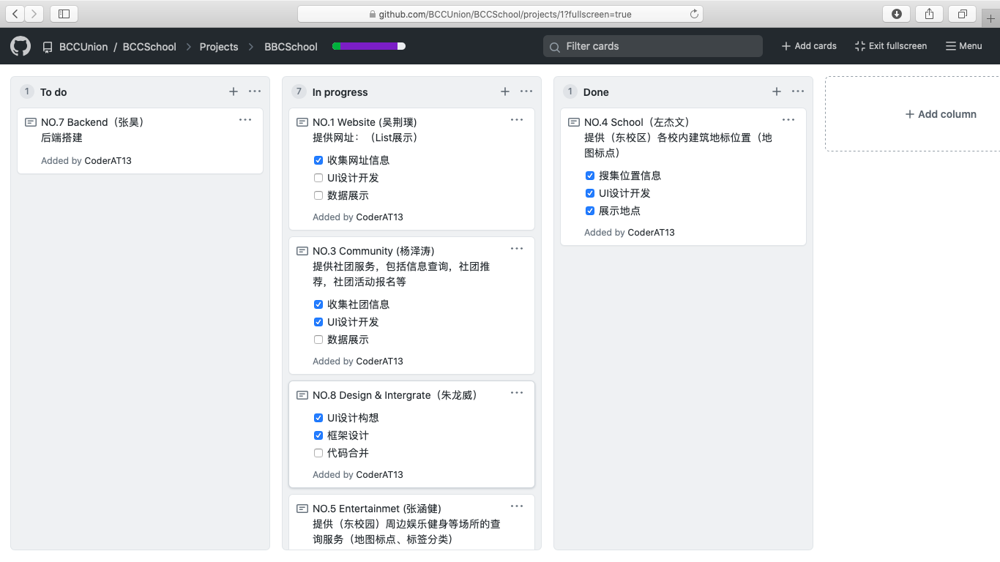
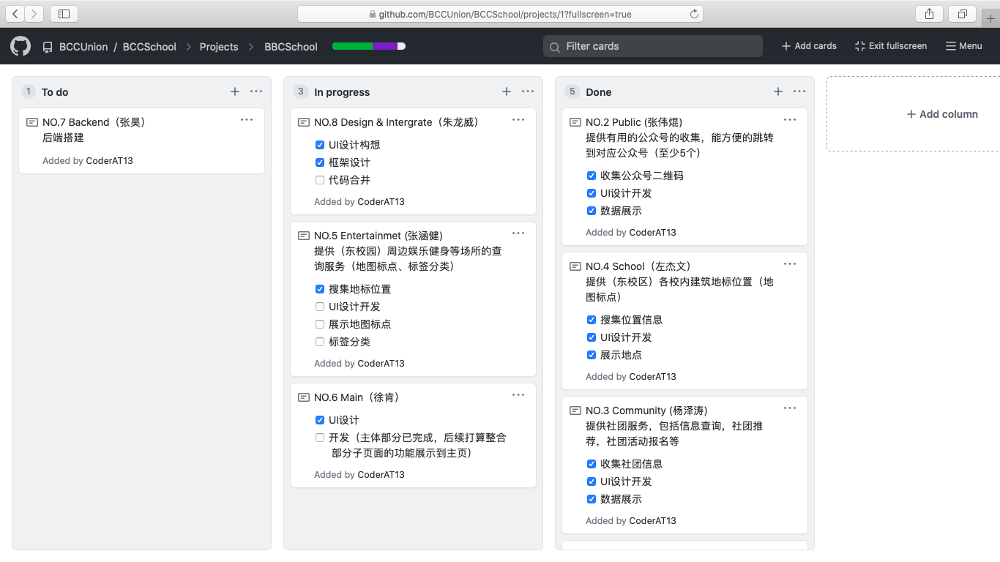
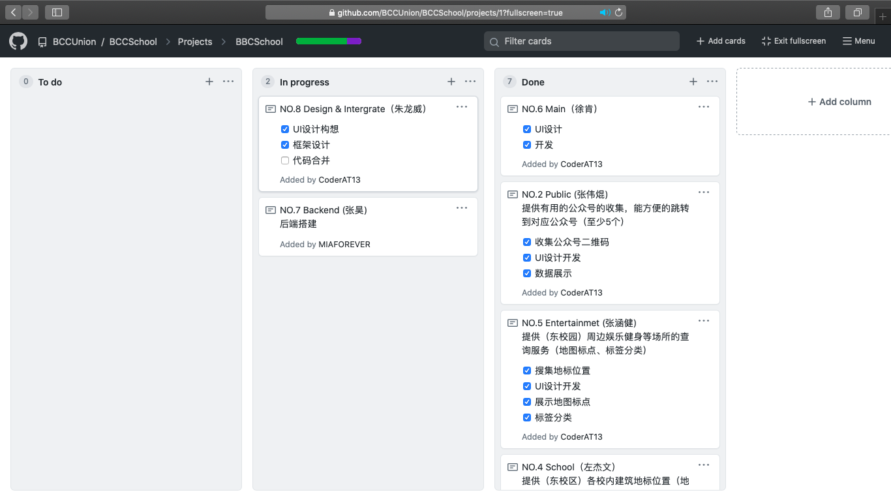

# 第四次团队作业经验总结

by 张淇

## 1. Scrum

本次团队作业的第一个任务是“项目经理阅读《Scrum and XP》指定内容并实践”，所以在团队着手做作业前，我（项目经理）先阅读完了该书的相关内容。并且在第一次会议上跟队友分享了Scrum的基本流程以及我个人对Scrum的理解。帮助队友对整个过程有个大致的了解，避免由信息不对成所带来的种种弊端。**这一步骤我认为是非常重要的，**因为它能帮助团队成员在后续的行动中能够理解每一步行动的原因及目的，进而让团队的配合更好，执行更加具体。

## 2. 故事板（Product Backlog）

本部分由产品负责人完成，主要参考了书中的格式以及第三次作业中已经完成的“初步需求调查”。因为没有“鸡”角色，所以我们只能够通过负责人之间的讨论与商量确定了每条故事的Importance，这一点我认为在实际开发中应该是对应需求收集/分析阶段，是需要花费较大的精力与顾客（“鸡”角色）进行商讨的，而在团队作业中受条件限制我们简化了该过程。

## 3. Sprint Planning Meeting 

这次会议花费了我们一个多小时的时间，期间花费时间最多的一项是确定Sprint Backlog，这点因为会议前没有做好一个合理的规划、设计好一个较为可行的方法，所以会议这部分效率比较低，大家的兴致都不高，最后是赵正蔚提了个方法才让会议的这一议程顺利完成。然后对Product Backlog每个条目相应故事点的评估也是在会议中占了比较多时间的，因为需要整个团队对每个故事进行评估，加上故事条目也比较多，所以就花费比较多时间。但是我们认为这个环节花费的时间还是很有价值的，因为它帮助开发团队更深入地明白我们的Srpint目标。

之后讨论的DDL以及界限问题，这一部分进度比较快：受到本次团队作业的时间限制，以及下一次团队作业的内容影响，我们团队决定**第一次时封闭开发的时间是五天半**。

这一部分的的经验是在计划会议之前应该做好一个比较齐全的准备来进行保证“确定Sprint Backlog”这个议程顺利进行，以及需要整个团队的积极参与才能让这个会议发挥其应有的作用。

## 4. Sprint 过程

在这一部分中，为了保证大家的开发工作有序进行，以及让大家在团队的贡献度大致相同，所以开发团队组长张涵健决定大家在Sprint Backlog中自己先选一个条目进行完成，并且**直接使用GitHub中自带的看板功能进行进度管理**，具体情况如下：

看板在开发过程的应用能够很直观的明白团队的进度，能够及时提醒团队中部分成员及时开工，以及从某种意义上也能统计开发成员的贡献。

## 5.Sprint演示 & Sprint回顾会议

在回顾会议中，我们团队认为在计划会议中**对故事点的估计还是偏乐观一些**的，受到时间以及下一次作业的影响，我们团队决定的**第一次封闭开发的时间是五天半**。从理论上说如果开发团队的全部人都是100%投入的话，那么这个目标是可以完成的，但是目前正处于期末阶段，同学同时还需要顾及其他科目的大作业，所以**实际投入的精力大概是预计的80%左右**，导致我们在Sprint演示时并没有按照目标那样演示一个完整的、已经集成的程序，而是只能够分别展示各自的部件。

关于这种情况，作为团队项目经理的我有些不知所措，所以询问了老师。**在听取了老师的建议后**，我们团队在这个过程后增加了一个小的迭代周期用于弥补没有完成的任务，从而实现目标。

这一部分的经验是：对于一个新团队的故事点的估计，应该做好“最坏的打算”，不应该想着每个人会在封闭开发中会100%的投入，而是应该像书中所推荐的那样假设实际生产效率为70%来确定周期或者确定Sprint Backlog。

## 6. 小结

作为团队的项目经理，我在学习Scrum方法，以及具体执行的过程收获颇多。虽然我们团队开发的项目并不大，但是在整个过程中还是遇到这样或者那样的问题需要去解决，很庆幸有这么一种方法能够指引着我们把工作持续地进行下去。虽然最后执行的结果与我们的目标还是有那么一些出入，但是我们也从中吸取了一定的教训。我想如果要用一句话来形如项目管理的话，应该就是“凡事预则立，不预则废”。

